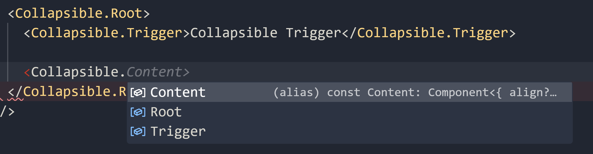

## 100% Lazy execution

The entire Qwik UI library does not execute code until interaction. Your components are HTML, until the user decides to interact with them.

## Bundling improvements

We have reduced the bundle size significantly of the headless library. If you are a Qwik library author, please refer to [this issue](https://github.com/QwikDev/qwik/issues/5473) as it may impact your bundle size as well.

## Dot notation

The biggest change of v0.4 is the addition of dot notation to the API. Also known as "namespaced components".

This includes our largest breaking change to Qwik UI yet. We hope it is the largest ever, and want to ensure a much smoother transition going forward. Before we can do that, we need to make sure the API's are consistent across the library.

**The component API's have been updated to use dot notation.**

We believe that dot notation will significantly improve the developer experience. Below are some of the benefits of dot notation.

### Simple Imports

In previous versions, imports needed to be defined for each component.

```tsx
import { Collapsible, CollapsibleTrigger, CollapsibleContent } from '@qwik-ui/headless';
```

While this is trivial with three components, it can be a pain with the more "pieces" a component has.

```tsx
import {
  Combobox,
  ComboboxControl,
  ComboboxIcon,
  ComboboxInput,
  ComboboxLabel,
  ComboboxListbox,
  ComboboxOption,
  ComboboxPopover,
  ComboboxTrigger,
  ResolvedOption,
} from '@qwik-ui/headless';
```

In v0.4, the new import syntax is the following:

```tsx
import { Collapsible, Combobox } from '@qwik-ui/headless';
```

### TypeScript Autocomplete

The searchability of available components has also been improved. You can now use the autocomplete feature to find a specific sub-component.



### Improved legibility

For longer component names, the dot notation is arguably more legible. For example, `Combobox.Listbox` vs. `ComboboxListbox`.

### Migration Cheat Sheet

As an easier way to migrate, we've created a mini cheat sheet below. If you have any questions, or need help migrating, don't hesistate to reach out to us on Discord.

**Components named <Component>, like <Accordion> are now <Accordion.Root />**

> Except for <Modal> and <Popover>, which is now <Modal.Panel /> and <Popover.Panel /> respectively.

With new root components, the **main props** have been moved to the root component. (for example, props previously on the Popover and Modal panels).

Ex:

```
<Modal bind:show> -> <Modal.Root bind:show>
```

For further reference, read the [RFC](https://github.com/qwikifiers/qwik-ui/issues/700) on dot notation.

### Popover Refactor

Based on feedback we have received from the community, we have also improved the developer experience of the Popover component.

```tsx
import { component$ } from '@builder.io/qwik';
import { Popover } from '@qwik-ui/headless';

export default component$(() => {
  return (
    <Popover.Root gutter={4}>
      <Popover.Trigger class="popover-trigger">Click me</Popover.Trigger>
      <Popover.Panel class="popover-panel">
        I am anchored to the popover trigger!
      </Popover.Panel>
    </Popover.Root>
  );
});
```

- By default, the popover is now anchored to its trigger. The API surface should also be simpler.

- A new `hover` prop has also been introduced on the root, useful for things like tooltips.

- Programmatically toggling the popover is still possible, make sure to put the same id on the `<Popover.Root />` that is passed to the `usePopover` hook. Refer to the docs for more info.

- popover-showing and popover-closing classes have been deprecated. Please use the `data-open` and ``data-closing` attributes instead.

- The `data-open`, `data-closing`, and `data-closed` data attributes have been added to the popover.

#### <Popover.Root />

There is a new root compomnent. Configurable props have been moved to the root component.

#### Deprecated Props

- You no longer need to style the popover open state with `:popover-open`. Instead, use the `data-open` attribute for it to style across browsers.

```css
.popover-panel[data-open] {
  background: green;
}
```

- You no longer need to pass a `popovertarget` prop to the `<Popover.Trigger />` component. Same with an id prop on the `<Popover.Panel />` component.

- The `placement` prop has been deprecated, and combined with the `floating` prop.

For example, `floating="right` will now float the popover to the right.

#### Opting out of the floating library

To opt-out of the floating library, set the `floating={false}` on the `<Popover.Root />` component.

May 2024, Chrome will be adding support for the CSS anchor API. This will allow us to remove the floating UI library entirely when that gains more support across browsers.

### Docs Improvements

A couple of docs improvements have been made:

- The docs have been updated to reflect the new API.
- The headless docs no longer include styles in the examples. There is an example CSS section in each component page. If you do not find one, please open an issue on GitHub.
- Part of the Accordion and Modal docs have been simplified
- The examples now include icons from the `qwikest/icons` package rather than an abstract component you could not use.
