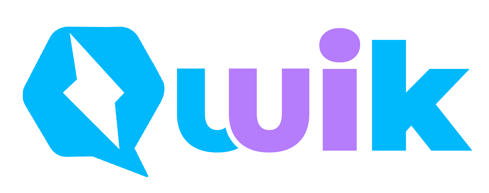

<p align="center">
  <br>
  
  <br>
  <br>
</p>

<h1 align='center'>Qwik UI</h1>

<div align='center'>
  The components library for <a href='https://github.com/BuilderIO/qwik'>Qwik</a>
  <br><br>

  <a href='https://img.shields.io/npm/v/@qwik-ui/core?label=npm%20version'>
  
  </a>
  <a href='https://opensource.org/licenses/MIT'>
  
  </a>
  <a href='#contributors'>
  
  </a>

</div>
<br>
<details>
<summary>Table of Contents</summary>


- [⚠ This is not ready for production!](#-this-is-not-ready-for-production)
- [Installation](#installation)
- [Example](#example)
- [Contributing](#contributing)
- [Code Of Conduct](#code-of-conduct)
- [Contributors](#contributors)
- [Related Links](#related-links)
- [License](#license)

</details>

## ⚠ This is not ready for production!

This library is still in early stages and once we'll collect enough feedback from the community we'll release the first beta version.

We still need to

- [x] Design a normal logo
- [ ] Build a proper documentation website
- [ ] Add tests
- [ ] Fix bugs
- [ ] more...

<br/>

## Installation
> Please create issue if you encounter bugs.

```console

npm install -D @qwik-ui/core
```

<br/>

## Example

```typescript

import { Alert } from '@qwik-ui/core';


export Page = component$(()=> {
  return (

    <div>
      <Alert class="alert-success">Some message</Alert>
    </div>
  )
})

```

## Contributing

Want to contribute? Yayy! 🎉

Please read and follow our [Contributing Guidelines](CONTRIBUTING.md) to learn what are the right steps to take before contributing your time, effort and code.

Thanks 🙏

<br/>

## Code Of Conduct

Be kind to each other and please read our [code of conduct](CODE_OF_CONDUCT.md).

<br/>

## Contributors

Thanks goes to these wonderful people ([emoji key](https://allcontributors.org/docs/en/emoji-key)):

<!-- ALL-CONTRIBUTORS-LIST:START - Do not remove or modify this section -->
<!-- prettier-ignore-start -->
<!-- markdownlint-disable -->
<table>
  <tbody>
    <tr>
      <td align="center" valign="top" width="14.28%"><a href="https://hirez.io/?utm_source=github&utm_medium=link&utm_campaign=qwik-ui"><br /><sub><b>Shai Reznik</b></sub></a><br /><a href="https://github.com/qwikifiers/qwik-ui/commits?author=shairez" title="Code">💻</a> <a href="https://github.com/qwikifiers/qwik-ui/commits?author=shairez" title="Tests">⚠️</a> <a href="#infra-shairez" title="Infrastructure (Hosting, Build-Tools, etc)">🚇</a> <a href="https://github.com/qwikifiers/qwik-ui/commits?author=shairez" title="Documentation">📖</a> <a href="#maintenance-shairez" title="Maintenance">🚧</a> <a href="https://github.com/qwikifiers/qwik-ui/pulls?q=is%3Apr+reviewed-by%3Ashairez" title="Reviewed Pull Requests">👀</a> <a href="#ideas-shairez" title="Ideas, Planning, & Feedback">🤔</a></td>
      <td align="center" valign="top" width="14.28%"><a href="http://www.gilfink.net"><br /><sub><b>Gil Fink</b></sub></a><br /><a href="#infra-gilf" title="Infrastructure (Hosting, Build-Tools, etc)">🚇</a> <a href="https://github.com/qwikifiers/qwik-ui/commits?author=gilf" title="Tests">⚠️</a> <a href="https://github.com/qwikifiers/qwik-ui/commits?author=gilf" title="Code">💻</a> <a href="https://github.com/qwikifiers/qwik-ui/commits?author=gilf" title="Documentation">📖</a> <a href="#ideas-gilf" title="Ideas, Planning, & Feedback">🤔</a> <a href="https://github.com/qwikifiers/qwik-ui/pulls?q=is%3Apr+reviewed-by%3Agilf" title="Reviewed Pull Requests">👀</a></td>
      <td align="center" valign="top" width="14.28%"><a href="https://it.linkedin.com/in/giorgio-boa"><br /><sub><b>Giorgio Boa</b></sub></a><br /><a href="https://github.com/qwikifiers/qwik-ui/commits?author=gioboa" title="Code">💻</a> <a href="https://github.com/qwikifiers/qwik-ui/commits?author=gioboa" title="Tests">⚠️</a> <a href="https://github.com/qwikifiers/qwik-ui/commits?author=gioboa" title="Documentation">📖</a> <a href="#ideas-gioboa" title="Ideas, Planning, & Feedback">🤔</a> <a href="https://github.com/qwikifiers/qwik-ui/pulls?q=is%3Apr+reviewed-by%3Agioboa" title="Reviewed Pull Requests">👀</a></td>
      <td align="center" valign="top" width="14.28%"><a href="https://github.com/reemardelarosa"><br /><sub><b>John Reemar Dela Rosa</b></sub></a><br /><a href="#maintenance-reemardelarosa" title="Maintenance">🚧</a></td>
      <td align="center" valign="top" width="14.28%"><a href="https://github.com/nnelgxorz"><br /><sub><b>Glenn Becker</b></sub></a><br /><a href="https://github.com/qwikifiers/qwik-ui/commits?author=nnelgxorz" title="Code">💻</a> <a href="https://github.com/qwikifiers/qwik-ui/commits?author=nnelgxorz" title="Tests">⚠️</a> <a href="https://github.com/qwikifiers/qwik-ui/commits?author=nnelgxorz" title="Documentation">📖</a> <a href="#ideas-nnelgxorz" title="Ideas, Planning, & Feedback">🤔</a> <a href="https://github.com/qwikifiers/qwik-ui/pulls?q=is%3Apr+reviewed-by%3Annelgxorz" title="Reviewed Pull Requests">👀</a></td>
    </tr>
  </tbody>
</table>

<!-- markdownlint-restore -->
<!-- prettier-ignore-end -->

<!-- ALL-CONTRIBUTORS-LIST:END -->

This project follows the [all-contributors](https://github.com/all-contributors/all-contributors) specification. Contributions of any kind welcome!

<br/>

## Related Links
- [Qwik UI Discord](https://discord.gg/PVWUUejrez)
- [Qwik Docs](https://qwik.builder.io/)
- [Qwik Discord](https://qwik.builder.io/chat)
- [Qwik GitHub](https://github.com/BuilderIO/qwik)
- [@QwikDev](https://twitter.com/QwikDev)
- [Vite](https://vitejs.dev/)

## License

MIT
