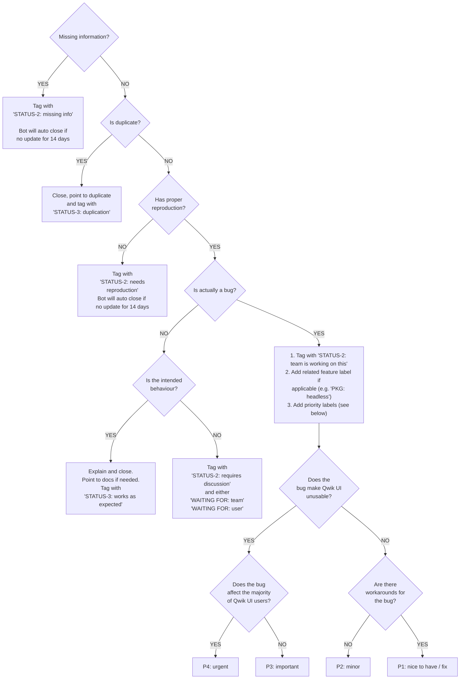
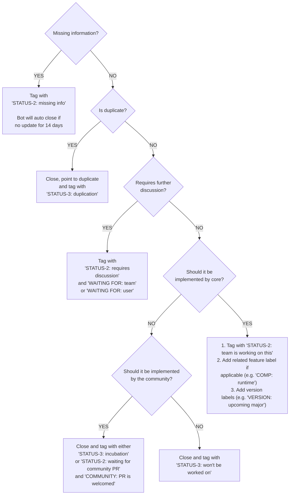

# Triage Guide

Welcome aboard! In this project, we take on bugs and grow enhancements with the expertise of seasoned repo medics.

Our goal is to keep Qwik UI in top shape, ensure the project runs seamlessly, and have a blast while doing it.

## Note about tags prefixes:

1. **STATUS-1**: The initial `needs triage` gets automatically added to newly created issues
2. **STATUS-2**: A "waiting for someone/something" status.
3. **STATUS-3**: The final state of an issue. This is a "resolution" status.

---

👇 _Inspiration for the diagrams below came from the Vite project_

## Bug Triaging Process

Our bug triaging process ensures that every reported issue gets the proper attention it needs. We sort, prioritize, and assign bugs to the right team members for swift resolution.

Here's how we handle bug reports in the Qwik UI repository:

---

## Enhancement Triaging Process

Got a fantastic new feature idea or a brilliant improvement to enhance Qwik UI?

We're here to ensure these enhancements are thoroughly evaluated, prioritized, and brought to life.

The team prioritizes work based on the number of 👍 votes from the community on each issue.

Now, let's dive into how we manage enhancement requests in the Qwik UI repository:

## Thank You!

To all our incredible contributors, thank you! Your enthusiasm and hard work keep Qwik UI moving forward with fresh ideas and improvements. We're grateful for every bit of effort you put in 🫶

Together, we're building something special. Let's keep up the momentum and continue making Qwik UI better every day!
